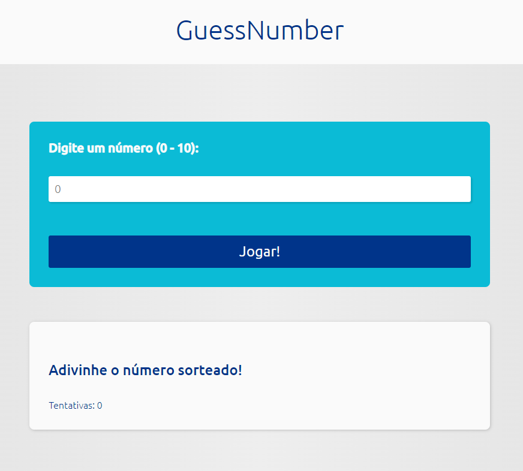
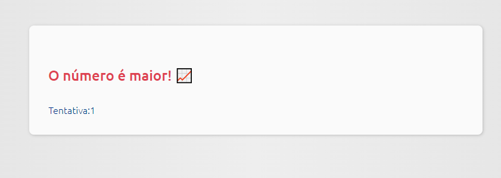

# Guess-Number
Programa de um jogo simples em que o computador sorteia um número de 1 a 10 e o jogador adivinha o número.

## Site
https://guessnumber-nine.vercel.app/

# Tela do jogo na página do site

## Tela inicial

## Tela resposta errada

## Tela resposta certa
